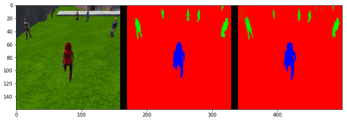
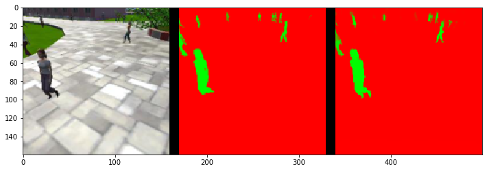
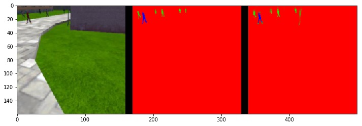

## Project: Follow Me
____

The objective of this project was to train a fully convolutional network to perform semantic segmentation and allow for target tracking on a quadcopter.
Final average IoU obtained after 22 epochs of training is 0.475.
#### Structure of the project:

All the files and their content is described below:

- [*code/model_training.ipnb*](./code/model_training.ipynb): Notebook containing the network architecture and used for training.

- [*code/data_augmentation.ipnb*](./code/data_augmentation.ipynb): Contains code used to perform horizontal flipping on the images and double the dataset size.

- [*data/weights*](./data/weights/): Weights of the trained networks.

- [*code/keras_viz_dependencies.txt*](./code/keras_viz_dependencies.txt): Requirement for keras.utils.vis_utils.plot_model.
- [*docs/misc/model_architecture.png*](./docs/misc/model_architecture.png): Picture of the network architecture.
____

#### Experiment Analysis :

Let us describe the various steps and information required to replicate our results.

##### Dataset
We were provided with an initial dataset composed of 4131 labelled training images and 1184 labelled validation images. The expectaction was for us to collect additional data using the QuadCopter simulator provided by Udacity.
The simulator kept crashing when collecting data for more than a few seconds. Due to that issue, we resorted to augmenting the default dataset to provide the model with more examples.
We applied the simplest image augmentation technique available by performing a horizontal flipping on the dataset. The code to run this operation is stored in the [*data_augmentation*](./code/data_augmentation.ipnb). 
This allows to double the size of the dataset and reduced the loss.

##### Loss Function

First investigation of the dataset reveal a severe imbalance. We build a function ```compute_class_weights(train_iter, n=100, skip=2)``` to obtain an estimated class distribution of the training data. The results were: { background: 0.98449375, pedestrian: 0.01390635  hero: 0.00292559 }.
This meant that the model was able to reach relatively low validation loss and yet perform poorly on our metric of interest, the average IoU.
To alleviate the imbalance we used the class inverse class distribution to weight the different component of the ```categorical_crossentropy()```. To support this we modified the code of the original ```categorical_crossentropy()``` to accept a weigth on each class:
```python
def w_categorical_crossentropy(weights):
    def loss_func(target, output, from_logits=False):
      # Note: nn.softmax_cross_entropy_with_logits
      # expects logits, Keras expects probabilities.
      if not from_logits:
        # scale preds so that the class probas of each sample sum to 1
        output /= tf.reduce_sum(
            output, axis=len(output.get_shape()) - 1, keep_dims=True)
        # manual computation of crossentropy
        epsilon_ = tf.convert_to_tensor(10e-8, output.dtype.base_dtype)
        output = tf.clip_by_value(output, epsilon_, 1. - epsilon_)
        return -tf.reduce_sum(
            weights * target * tf.log(output),
            axis=len(output.get_shape()) - 1)
      else:
        return tf.nn.softmax_cross_entropy_with_logits(labels=target, logits=output)
    return loss_func
```

To obtain the weights, a first approach was to use the inverse class distribution: c_i = 1 / P_i; w_i = c_i / sum(c). This method yielded the weights: { 0: 0.00244914,  1: 0.17338599,  2: 0.82416487 }. This flipped the problem. The gradient for background was vanishing, leading to a large amount of false positive for pedestrians and target. 
Our next experiment was to linearly interpolate the weights from the values above to the unit vector by using the relative epoch. ie w_i(t) = (1 - w_i) * epoch_i/num_epochs + w_i 
The functionality was interpreted via Keras callbacks.
The performance of this setup was abysmal. The network was unable to breach below 0.1 categorical cross-entropy. A posteriori, an heuristic explanation for this is the following: By modifying the loss weights mid-learning we are changing the shape of the target distribution that the network is learning.
This means that the information encoded in the network weights at previous epochs becomes mostly useless to the current epoch.

We finally adopted a less aggressive approach by using the weights {0: 1, 1: 1.05, 2: 1.1}. This slightly inflates the gradient for misclassified humans, but do not dampen learning on the background class.


##### Network Architecture

We will define blocks using the following nomenclature: BLOCK(kernelWxkernelH, Stride, depth) when relevant.
Our network is composed of an assembly of 5 main building blocks:

- encoder blocks : __ENCODER(depth)__=[ SEPARABLE_CONV2D(3x3, 1) -> RELU -> BATCHNORM ]

- decoder blocks : __DECODER(concat, depth)__=[ BILINEAR_UPSAMPLE(2x2) -> CONCATENATE(concat) -> [ SEPARABLE_CONV2D(3x3, 1) -> RELU -> BATCHNORM ] * 2 ]

- downsampling blocks : __DOWNSAMPLE__=[MAXPOOL(2x2, 2)] OR [ENCODER(2x2, 2)]

- dropout blocks : __DROP__=[SPATIAL_DROPOUT2D]

- 1x1 convolutional block : __1x1CONV2D(depth)__=[CONV2D(1x1, 1) -> RELU -> BATCHNORM]


The picture of the final architecture is available [*here*](./docs/misc/model_architecture.png). This architecture is inspired from SegNet.

The full architecture of the final model using the previous notation is as follow:

[INPUT] -> [ENCODER(32) -> DOWNSAMPLE -> DROP] -> [ENCODER(64) -> DOWNSAMPLE -> DROP] -> [ENCODER(128) -> DOWNSAMPLE -> DROP] -> [1x1CONV2D(256)] -> [DECODER(encoder128, 128) -> DROP] -> [DECODER(encoder64, 64) -> DROP] -> [DECODER(encoder32, 32) -> DROP] -> [OUTPUT] 

Note that we used MAXPOOL for all the final model downsampling.


    Total params: 142,814
    Trainable params: 140,958
    Non-trainable params: 1,856

##### Results:
Evaluation Set size:


<table class="tg">
  <tr>
    <th class="tg"></th>
    <th class="tg">following</th>
    <th class="tg">not visible</th>
    <th class="tg">far away</th>
  </tr>
  <tr>
    <td class="tg">number of sample</td>
    <td class="tg">542</td>
    <td class="tg">270</td>
    <td class="tg">322</td>
  </tr>
</table>


Average IoU:


<table class="tg">
  <tr>
    <th class="tg">aIoU for \ situation</th>
    <th class="tg">following</th>
    <th class="tg">not visible</th>
    <th class="tg">far away</th>
  </tr>
  <tr>
    <td class="tg">background</td>
    <td class="tg">0.996124</td>
    <td class="tg">0.989919</td>
    <td class="tg">0.997138</td>
  </tr>
  <tr>
    <td class="tg">people</td>
    <td class="tg">0.423597</td>
    <td class="tg">0.793352</td>
    <td class="tg">0.51175</td>
  </tr>
  <tr>
    <td class="tg">hero</td>
    <td class="tg">0.92578</td>
    <td class="tg">0</td>
    <td class="tg">0.310087</td>
  </tr>
</table>


Confusion Table:


<table class="tg">
  <tr>
    <th class="tg">confusion \<br>  situation</th>
    <th class="tg">following</th>
    <th class="tg">not visible</th>
    <th class="tg">far away</th>
  </tr>
  <tr>
    <td class="tg">true positive</td>
    <td class="tg">539</td>
    <td class="tg">0</td>
    <td class="tg">155</td>
  </tr>
  <tr>
    <td class="tg">false positive</td>
    <td class="tg">0</td>
    <td class="tg">60</td>
    <td class="tg">2</td>
  </tr>
  <tr>
    <td class="tg">false negatve</td>
    <td class="tg">0</td>
    <td class="tg">0</td>
    <td class="tg">146</td>
  </tr>
</table>


Example predictions:





_left_: input image, _middle_: target mask, _right_: output mask.


____

#### Hyperparameters :

All hyper parameters were obtained via a manual grid search and following various recommendations found online.

- *learning_rate* = 0.001 : Found via manual grid search. other lr used were 0.1, 0.05 and 0.0001.
- *batch_size* = 8 : Initial training was ran on a small local GPU forcing the use of small batches. After moving to the cloud instance, we found out this batch size kept performing well. Other batch size used in the grid search: 16, 32, 256. Note that a small batch size corresponds with recommendations made by Yann LeCun in [*Efficient Backprop*](http://yann.lecun.com/exdb/publis/pdf/lecun-98b.pdf), where he strongly yields toward stochastic gradient update. Note that this choice of batch size will cause training as a whole to be slower.
- *num_epochs* = 30 : We've tried (5, 10, 20, 25, 60) combined with early stopping. Early stopping often stopped learning around between 25-30 naturally. over the whole experiment, 30 appears to offer a reasonable hard cutoff to the training process.  
- *steps\_per\_epoch* = train_size/batch_size : We follow the recommandation and adapt the number of steps per epoch to the size of the dataset and the batch size. This ensure than each sample is seen only once for a given epoch. 
- *validation_steps* = val_size/batch_size : We apply the same reasoning as above.
- *dropout_rate* = 0.1 : after moving to a deeper network we increased the dropout rate to 0.6. As a consequence the network performance collapsed. Other rates selected were 0.4 and 0.2, 0.3. With the exception of 0.3, they all led to aIoU below 0.4.
- *workers* = 2: the EC2 instance has 1 GPU. but 4 virtual GPU. We chose 2 to allow the batch generator to run in a process on the CPU.

- *loss weights*: As described above, we modified the categorical\_crossentropy to account for the severe class imbalance in the dataset. A first attempt at obtaining good weights used a inverse pixed count for each class   in a sample of 100 images in the dataset. This led to the weights: { 0.00241022, 0.14757306,  0.85001672}. This set of weight was downscaling the gradient and slowed down learning in addition to flipping the imbalance. With no gradient on misclassified background, the network was returning a large amount of false positive. We then implemented a callback to allow those weights to converge to __1__ after a predefined number of epochs. The effect on learning was catastrophic. A heuristic explanation is that by changing the weights at each epochs we were effectively changing the function to be learned by the network as it was learning. After trial and error we stopped on the weights: {1.0, 1.05, 1.1} to keep the gradient close to the baseline categorical\_crossentropy, with some added weight on the humans detection.
____

##### Concepts :

__1x1 Convolutional layers__ have the following characteristics:

*  1x1xfilter_size (HxWxD),
*  stride = 1, and
*  zero (same) padding.
* 4 dimensions (batch size, height, width, depth).

Contrary to fuly connected layers, they preserve spatial information as the width x height of the parent tensor is preserved.
They are part of the decoder block of a fully convolutional network.
They should be used when we wish to preserve spatial information in the network.
In addition they allow us to feed images of different size inside the network.
To use them we just need to set the parameter of our conv2d layers as follow:
* 1x1 kernel size,
* stride = 1,
* same padding.
in tensorflow, the usage would be:
```python
one_conv_layer = tf.nn.conv2d(input, filter=[1,1,1,n], stride=[1,1,1,1], padding="SAME")
```
__Fully Connected layers__ are the standard layers used in a multi-layer perceptron. They are used as the final layers of standard convnets as well as most other types of neural network with 1D-2D output (Note that the second dimension would be the batch size here). They are at the basis of the universal function approximator ability of neural networks.
To use them one need to perform a matrix multiply between the input activation of the layer and the weight matrix, following by the addition of a bias.
in tensorflow, this would be:
```python
fully_connect_layer = tf.add(tf.matmul(input, weights), bias)
```
____
 
##### Image Manipulation :


Standard convnet can be summed up as an encoder followed by a series of fully connected layer. This architecture proves very useful for binary  classification tasks of the form "is there an instance of object X in the image?". But fully connected layers do not keep track of the spatial distribution of features in the image. by replacing the fully connected layer with a decoder, we can  start using deep learning to answer questions that rely on the spatial distribution of objects within the network. Pixelwise classification, also called semantic segmentation is a prime use for those encoder/decoder architecture. Some Industrial application for robotics could be :
- Identifying the exact location of an object in a cluttered environment.
- Road and pedestrian detection for self-driving vehicles.

In more details the role of the encoder is to extract features from the image. The decoder will up-scale the features generated by the encoder to map them back to a tensor of the same shape as the input image and allow pixelwise classification.

A problem that may arise is  the loss of resolution in the output tensor caused by the encoding of the features. A solution to this is the use of skip layers, where the up-sampling layers in the decoder are concatenated with the equivalent tensor in the encoder. This allows for more granular segmentation.

Another problem can be linked to the size of the network, as we may end up with  a larger number of weights than with a fully connected layer.  by using techniques such as bilinear upsampling and separable convolutional layers, we can keep the number of learnable weights manageable. 
____

##### Limitation of the model and extensions :

A neural network in a supervised learning setup, such as the one in this project, can only learn a function based on the input it was provided with.
Our solution uses a dataset composed only of humans, with the target individual a human with very specific features (woman, with brown hair, white skin and reddish clothes). The network can only learn to identify those features as it was not presented with anything else. This means that the network we've trained can only be applied to following this specific woman and identifying the presence of other humans in the field of frame. 

To follow other target types, such as animals or other specific humains, those would need to be integrated to the training data and the model would need to be trained again. 
To be able to follow several target with the same network, the output layer depth should be expanded for each additional potential target. At deployment time, the navigation node of the robot/quadcopter could use the appropriate the network to obtain the pixels classified with its chosen target. 
____
#####  Further improvements:

At this stage, we believe that the best way to improve the model is to collect more data. Due to the memory limitation of our machine, the simulator kept crashing when recording images for more than a few seconds. Therefore we had to find other ways to increase the size of the dataset. We resorted to a simple data augmentation via horizontal flipping. After more research, it appears that several other image augmentation techniques have been developped by the computer vision community. The following Kaggle [*kernel*](https://www.kaggle.com/gaborfodor/augmentation-methods) displays a few of them. 

We noticed that the model had it worst performance when identifying the target from afar. If we can collect more data from the simulator, our main focus should be on finding more samples with this use case.